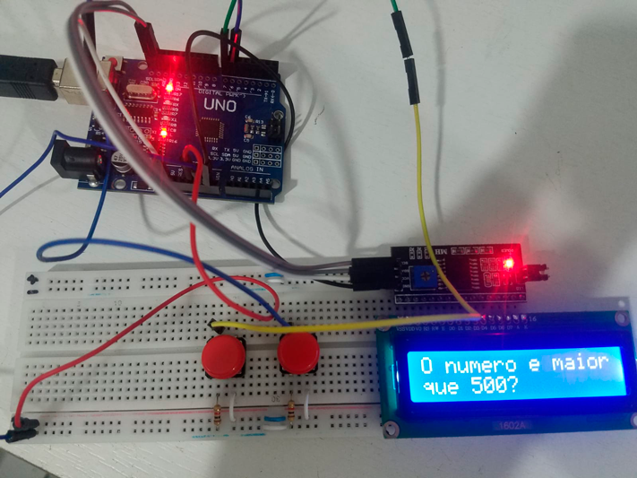
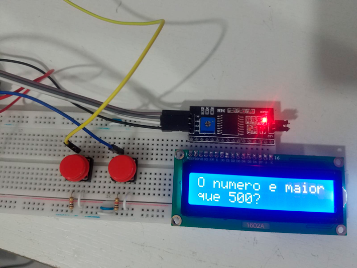

# Sketch - Adivinha um número entre 0 e 1000

Você escolhe um valor entre 0 e 1000, e o Sketch vai tentar adivinha-lo.
O valor máximo pode ser alterado para mais ou para menos que 1000. Fique a vontade!

### Itens utilizados:
1. Arduino UNO
2. Módulo I2C
3. LCD Display 16x2
3. 2 Pushbuttons
4. 2 Resistores de 510R
5. Protoboard
6. Jumpers

### Existe uma [outra versão](https://github.com/danilofariadutra/Arduino/tree/master/Adivinha_Numero) que disponibilizei via Monitor Serial, caso você não tenha um LCD Display

